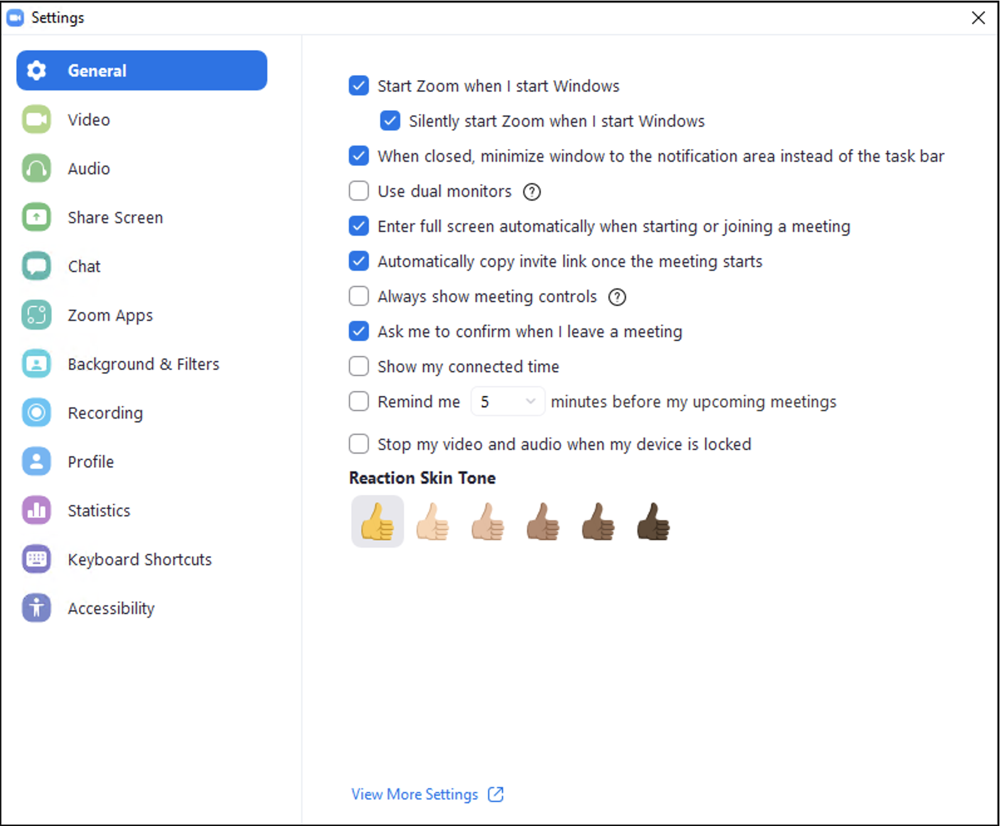
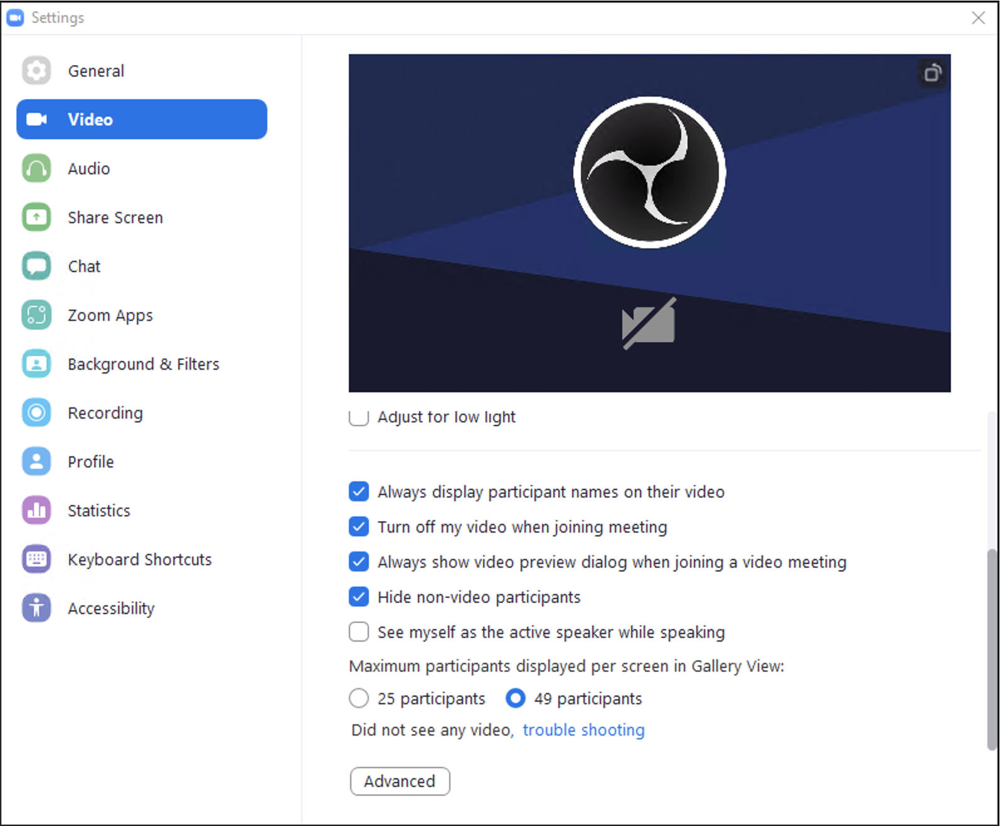
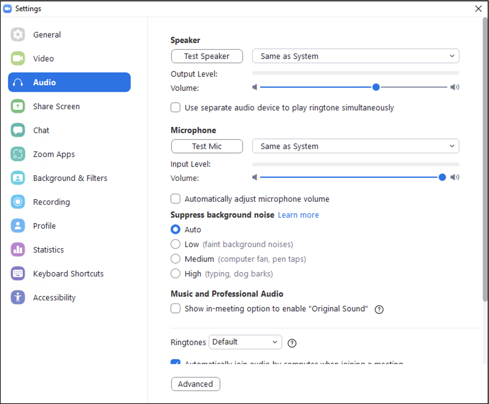
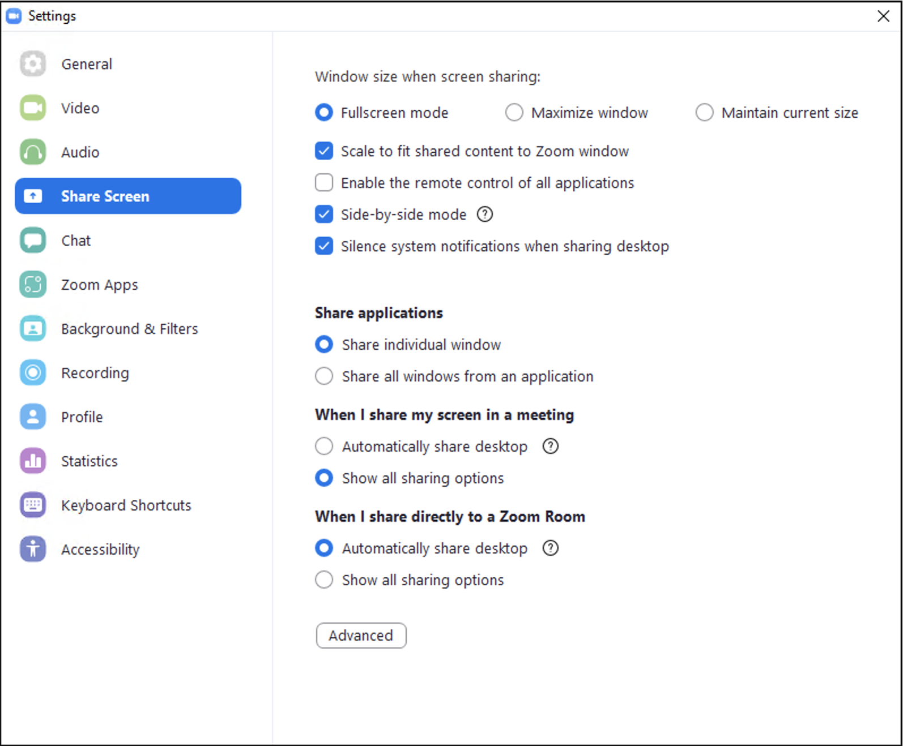

# Windows Azure VM for Cloud Platforms Streaming

This repo contains various assets used to provision a Windows-based VM in
Azure to run OBS for live streaming. This originally used Azure's "Standard NV6" machine type. [Azure Virtual Machine NV-series & NV_Promo SKU are retiring on 31 August 2022](https://github.com/azure-deprecation/dashboard/issues/174).

The VM should now be using the "Standard_NV12s_v3" machine type. As of 2021-09-03 pricing for this type is **$1.14/hour**. This is referred to as "NVv3-series" on the [Azure Products available by region](https://azure.microsoft.com/en-us/global-infrastructure/services/?products=virtual-machines) page.

To save money, [Deallocate](https://docs.microsoft.com/en-us/cli/azure/vm?view=azure-cli-latest#az_vm_deallocate) or [delete](https://docs.microsoft.com/en-us/cli/azure/vm?view=azure-cli-latest#az_vm_delete) if you're not using the instance to reduce costs as you see fit.

## Build VM

Use the `build_vm.sh` script to initially build the Windows 10 virtual
machine. You will need the `az` CLI installed.

When the provisioning process is complete, you'll be able to find the VM in
your Azure account in the stated Resource Group and then obtain its public IP
address.

RDP connect to the VM and be sure to **set the sound settings in your
RDP client** (eg: Remmina) to `remote`. Also be sure to connect a local folder
to the remote system so that you can transfer the audio driver.

Once connected, open a file explorer transfer the `vac462full.exe` from your
system to the Windows system's `C:\`.

## Imaging the VM

Before imaging the VM, you'll need to install vac462full.exe on the Windows machine. Contact a [Contributor](https://github.com/cloud-platforms-streaming/azure-obs-vm/graphs/contributors) to this repo for this file if you don't have it.

Next, run this command as an administrator to prepare the VM image (this will shut down the VM):
`C:\Windows\System32\Sysprep\sysprep.exe /oobe /generalize /unattend:C:\deploy.xml`

**Note**: We have tried automating these steps, but it seems to be a bit flaky (see [prepme.bat](https://github.com/cloud-platforms-streaming/azure-obs-vm/blob/main/prepme.bat)). Please file a pull request is you think you have a fix.

After the machine shuts down, follow [these
instructions](https://docs.microsoft.com/en-us/azure/virtual-machines/windows/capture-image-resource#create-a-managed-image-in-the-portal)
for creating a managed image.

## Deploy from an Image

If you imaged your VM, you can deploy from that image by using the
`image_vm.sh` script. Be sure to use the parameter for the correct image
reference in your account.

Example: `./image_vm.sh eastus /subscriptions/f4c5a52e-981d-4dcc-8ae1-23759d7a65c2/resourceGroups/C87B6867-F12F-4E37-AFF9-7203B183CB37/providers/Microsoft.Compute/images/0428013334obs-image-20210428101546`

Once the image is deployed, connect to it with RDP as above, then hit the
Windows Start button and type `c:\firstrun.bat` and hit enter. This will
prepare OBS for you.

You're good to go.

## Running the Built VM

You could also build the VM every time and go from there. You will want to
install the audio driver manually (by double clicking `vac462full.exe` in the
file explorer and following the prompts).

Then run `c:\firstrun.bat` and you are good to go.

## Testing latency to Restream endpoints

This is helpful for understanding latency from wherever the streaming rig is to the nearest Restream node: <https://restream.io/speed-test>

## Zoom Accounts

We maintain a number of Zoom accounts to prevent Zoom meetings from overlapping (one account cannot be in multiple meetings). It's highly encouraged to use one of these accounts as they're actively maintained for livestreaming purposes.

### Zoom Account Settings

There's no great way to capture all the settings for a Zoom account. Just be aware that there are account settings that impact the experience in the Zoom client (yes, this is a one time pain point).

The following screen shot is a complete capture of settings as of the week of 2021-10-04.

Note the settings that are annotated "Modified" are the ones you'll need to change in any new Zoom account.

## Zoom Client Settings

On the streaming rig, you'll need to configure Zoom to accommodate the OBS profiles we've setup. You do this once per image. It's encouraged to image your system after you update the following settings.

Again, screenshots will be used here because wording and contexts may change.

**Note: On the streaming rig, the mic and camera are muted in Zoom.**

### General

### Video

### Audio

### Share Screen

